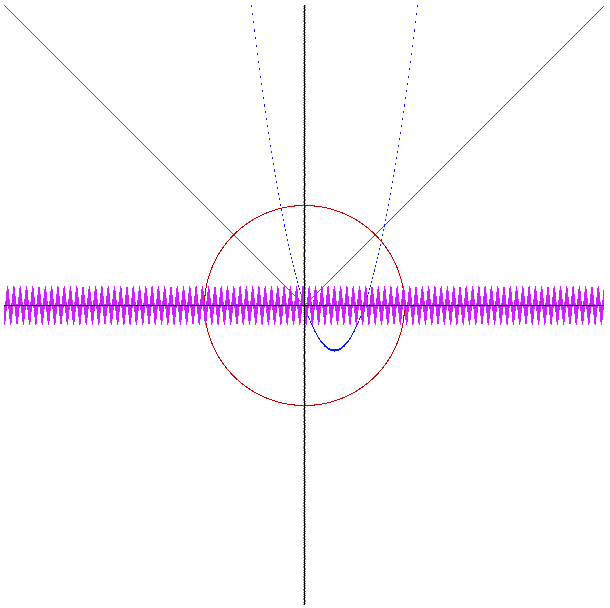

# Playground image elaboration from scratch in JS
DataImage playground containing experiments with ArrayBuffer

This image was built mainly from scratch by using ArrayBuffer and canvas object.
Isn't this awesome? That's so coool!
See how I did it.

(Give me time to refactor the code, I'm ashamed of lack of linters);

### Get started
#### Install
`npm install`

#### Start
`npm start`

#### Not gonna style this readme much. Feel free to send PR.